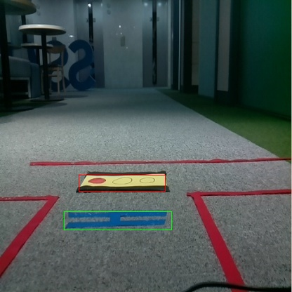
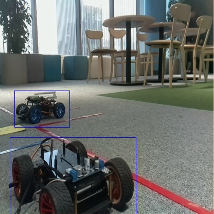
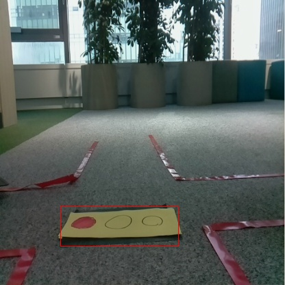
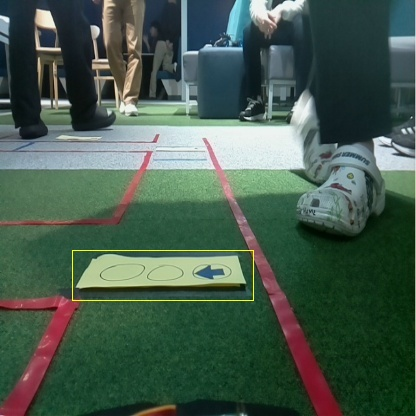
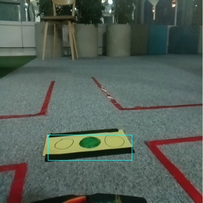

# 객체 탐지와 차선 검출을 이용한 On-Device 자율주행
목차
1. [요약](#요약)
2. [개요](#개요)
3. [배경 및 목적](#배경-및-목적)
4. [프로젝트 정의 및 구성](#프로젝트-정의-및-구성)
5. [객체 탐지](#객체-탐지)
6. [차선 검출](#차선-검출)
7. [코드](#코드)
8. [결과](#결과)
9. [한계점](#한계점)
10. [reference](#reference)

## 요약
|제목|내용|
|:---:|:---|
|프로젝트 명| 객체 탐지와 차선 검출을 이용한 On-Device 자율주행|
|프로젝트 기간|2023.11.20. ~ 2023.11.23.|
|주최|삼성 청년 SW 아카데미|
|개발환경|Raspberry Pi 4, Colab|
|기술스택|Python, PyTorch, OpenCV|
|팀 구성| 정현우, 이진수, 김영래, 김태범|
|결과|삼성 청년 SW아카데미 프로젝트 경진대회 우수상|


## 개요
- 삼성 청년 SW 아카데미 10기 임베디드 과정의 1학기 프로젝트 "라즈베리파이 Sensing Data를 활용한 IoT RC카 제작"의 결과물임.
- [DAMO-YOLO](https://arxiv.org/abs/2211.15444)(객체 탐지)와 HSV 변환(차선 검출)을 이용한 On-Device 기반 자율주행 RC Car개발을 목적으로 함.


## 배경 및 목적
- 본 프로젝트의 주목적은 자율주행에서 최악의 조건에서 최소한의 비용으로 자율주행을 진행하는 것을 목표로 함.
### 배경
- 자율 주행에 있어 가장 중요한 요소는 "안전"임.
- 운전자가 주행 중 자율 주행에 문제가 있다는 것을 인지하고 대응하는 "반응 속도"는 사고 발생 속도보다 느릴 확률이 높음. (이하 이와 같은 상황을 "비상 상황"이라고 함.)
- 비상 상황에 대한 자율 주행 프로세스가 필요함.

**On-Device**
- 국내외 많은 기업들이 자율 주행 서비스를 개발하고 있음.
- 이는 AI 기술의 고도화를 초래했으며 고사양의 환경이 요구됨.
- 기존 자율주행 프로젝트들에서는 이 문제를 클라우드 서버를 통해 해결하려고 함.
- 클라우드 서버와 같은 외부 (무선) 통신의 경우 다음 2가지 이슈가 존재함.
    - 보안성
    - 안정성 (속도 지연 등)

**Only Camera**
- 임베디드의 주 목적은 "low cost"임.
- LiDAR와 같은 고성능 센서보다 가격이 훨씬 저렴함.

### 목적
- 자율 주행차에서 발생할 수 있는 비상 상황을 On-Device 기술을 통해 대비하려고 함.
- [배경](#배경)에서 언급한 이슈들을 보완하기 위해 "카메라"만을 사용한 "On-Device" 형태의 프로그램을 개발하고자 함.

## 프로젝트 정의 및 구성
본 프로젝트 진행에 앞서 주행을 위한 트랙(이하 "트랙")을 직접 설계하고 이에 대한 프로세스를 정의함.

### 트랙 정의

### 프로세스 정의
|프로세스명|객체 탐지 프로세스|차선 검출 프로세스|
|:---:|:---:|:---:|
|흐름도|||
|정의|RC카 전방의 객체(다른 차량, 주행 신호 등)를 탐지하고 주행 여부를 판단하는 프로세스|트랙에 존재하는 차선을 검출하여 주행 방향(앞바퀴 각도)을 결정하는 프로세스|
|사용기술|DAMO-YOLO<sup>[1](#footnote_1)</sup>|HSV 변환|


## 객체 탐지
### 데이터 구축
0. 데이터 정의  
    정의한 트랙에서 탐지해야하는 객체는 다음과 같음.
    <!-- |Object|Image|Desc|
    |:---:|:---:|:---|
    |정지선(stop_line)|||
    |차량(car)|||
    |정지 신호(red_light)|||
    |좌회전 신호(left_light)|||
    |직진 신호(green_light)|||
     -->
    |Object|정지선(stop_line)|차량(car)|정지 신호(red_light)|좌회전 신호(left_light)|직진 신호(green_light)|
    |:---:|:---:|:---:|:---:|:---:|:---:|
    |image||||||
1. 데이터 수집  
    - 아래 코드를 통해 2000개를 원시 데이터를 수집함.
        ```python
        python3 tools/collect_data.py
        ```
2. 데이터 검토
    - 이후, 아래 조건에 충족될 경우 데이터를 제거하여 730 건의 원천 데이터를 확보함.
        1. 중복
        2. 초점이 안 맞음.
        3. 객체가 존재하지 않음.
3. 데이터 가공  
    - 아래 코드를 통해 labeling tools을 실행하고 라벨링을 진행함.
        ```python
        python3 tools/annotation_tool.py
        ```

### 모델 선정 및 학습
TBU

## 차선 검출
TBU

## 코드
TBU

## 결과
- [최종결과 원본 영상 - YouTube](https://www.youtube.com/watch?v=tees_aCu-jU)

## 한계점
- 트랙 한계
- 최적화 시도

## reference
- <a name="footnote_1">1</a> [Xu, Xianzhe, et al. "Damo-yolo: A report on real-time object detection design." arXiv preprint arXiv:2211.15444 (2022).](https://arxiv.org/abs/2211.15444)
- [DAMO-YOLO](https://github.com/tinyvision/DAMO-YOLO)
- [정준용, "자율주행차 키트 deep-mini로 배우는 자율주행 알고리즘", WikiDocs (May 17, 2023)](https://wikidocs.net/book/9493)
- [BINARY-ESG](https://github.com/LeeJinSoo-BIN/BINARY-ESG)